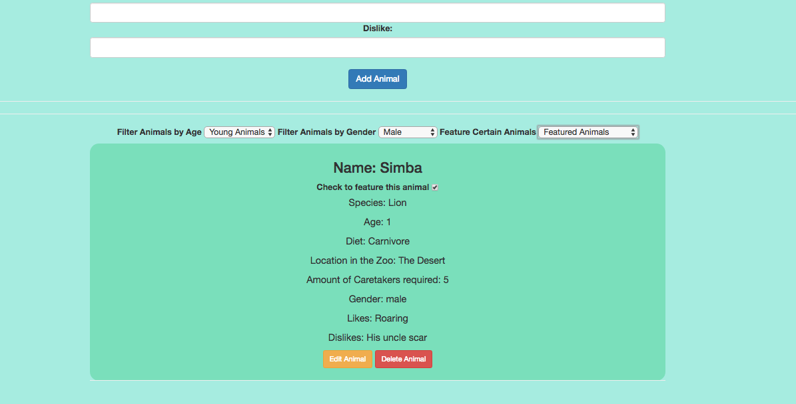

# _Local Zoo_

#### _This app lets users input animals to track at your local zoo. Friday, June 9th, 2017_

#### By _**James Higgins**_

## Description

_Users can input a new animal. They can view the list of inputted animals and edit or delete animals from that list. The user can filter the list by age(animals under 2 are considered "young", and animals older than 2 are considered "mature". Users can also filter animals by gender. Each animal also has a check box next to it. When checked, this animal becomes featured, and the user can filter between all, featured and non featured animals._

## Setup/Installation Requirements

### Access Atom Files

* _Ensure connection to the Internet_
* _On a mac using spotlight search type in terminal_
* _Once in terminal enter the following commands to clone the file to your desktop and open the repository:_
```
$ cd desktop
$ git clone https://github.com/jamesmilanhiggins/local-zoo
$ cd local-zoo
$ npm install
$ bower install
$ gulp serve
$ open localhost:3000 in your browser
```

## Known Bugs

* There are no known bugs at this time*


## Support and contact details

_Please contact James Higgins at James.Milan.Higgins@gmail.com if you have any questions._

## Technologies Used

* JavaScript
* Angular
* Node
* Bower
* HTML
* Bootstrap

### License

*This software is licensed under MIT license.*

Copyright (c) 2017 **_James Higgins_**



